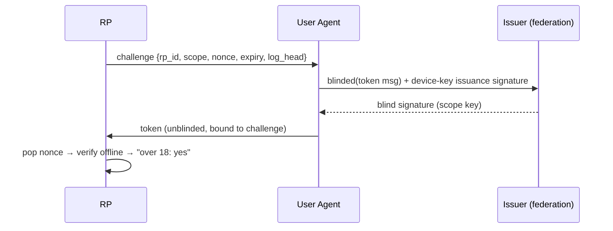

# zk-age-attest

**Prove you're old enough — without telling the website who you are, or telling the issuer
which site you're proving it to.** A runnable reference implementation and normative spec of
a privacy-preserving age-verification protocol, built on RFC 9474 RSA blind signatures.

> The "zk" in the name is shorthand for the *property* — the relying party learns **zero**
> beyond the predicate — not the *primitive*: the construction is RFC 9474 blind signatures,
> not zero-knowledge proofs.

## Why this exists

Age-assurance mandates are arriving faster than private ways to satisfy them. The usual
options come in two bad shapes: hand a government ID to every site that asks, or route every
check through a central age-check service that then learns your whole browsing pattern. Both
turn "prove your age" into "surrender your identity and activity."

This repo is a working argument that it's a false choice. Its distinguishing goal is
**auditability**: rather than promise privacy in a policy, every privacy claim ships with the
mechanism that checks it — a pure no-I/O verifier, RFC 9474 test vectors reproduced
intermediate-by-intermediate, a hash-chained key-transparency log, and a CI linkability
simulation that joins both sides' logs and asserts zero shared identifiers.

> **Status: research prototype.** The cryptography is RFC 9474 (RSA blind signatures),
> step-validated against the RFC's published test vectors, but this code has had no
> independent audit, makes no constant-time guarantees (Python big-int math), and must not
> be used in production.

## How it works (10 lines)

Auditably privacy-preserving age verification. A relying party (website/app) challenges the
user with a nonce; the user's agent gets the nonce **blind-signed** under an age-scope key
("over 13", "over 18", …) by an issuer federation; the relying party verifies the signature
**offline** against a single federation public key. The relying party learns only the age
predicate. The issuer never sees the nonce, the token, or the site. Neither side can link
the two events by content — and that claim is designed to be **checked, not trusted**.

The same flow, step by step:

1. Enrollment (once): an attester confirms your age bracket; the issuer stores only
   `{account_id, device_pubkey, max_scope, expiry}` — no date of birth, no documents.
2. A relying party (RP) hands your user agent a challenge `{rp_id, scope, nonce, expiry}`.
3. The UA builds a token message binding that challenge, then **blinds** it (RFC 9474).
4. The UA sends the blinded message to the issuer, authenticated by your device key
   (which also signs the blinded message hash — issuance can't be proxied wholesale).
5. The issuer rate-limits, blind-signs with the scope key, and learns nothing else.
6. The UA unblinds, checks the signature against the **transparency-logged** key, and
   hands the token to the RP.
7. The RP pops the pending nonce (replay defense), then verifies one standard
   RSASSA-PSS signature — pure local computation, zero network calls.



## Why it's different

- **Blind issuance**: the issuer signs a blinded message — unlinkability between issuer
  and RP logs is information-theoretic in content, not a retention policy.
- **Issuer-hiding**: one federation key per scope; the RP can only learn "an accredited
  issuer attested this," never which operator or upstream attester.
- **Auditable, not promised**: the verifier package has no I/O (enforced by an AST test
  and its dependency graph), federation keys live in a hash-chained transparency log the
  UA pins, the crypto reproduces RFC 9474's test vectors intermediate-by-intermediate,
  and CI runs a linkability simulation that joins maximal issuer+RP logs and asserts
  zero shared content identifiers.
- **Honest residuals**: issuance-timing correlation and token proxying are documented and
  measured (see [THREAT-MODEL.md](docs/THREAT-MODEL.md)), not hand-waved.

## Quickstart

```bash
uv sync --all-packages
uv run python scripts/init_federation.py --state demo-state
./scripts/run_demo.sh          # starts issuer :8001 and demo RP :8002
```

In another terminal:

```bash
uv run zkage-ua enroll --issuer http://127.0.0.1:8001 --claim-age 21 --state ./ua-state.json
uv run zkage-ua verify --rp http://127.0.0.1:8002 --scope 18 --state ./ua-state.json
# → verified: over-18
```

Or open http://127.0.0.1:8002 for the demo RP page.

## Repo map

| Path | What it is |
|---|---|
| `packages/zkage-core` | RFC 9474 RSABSSA, token codec, keys, device keys, transparency log (deps: `cryptography` only) |
| `packages/zkage-verifier` | Pure offline verifier SDK (deps: `zkage-core` only — the no-phone-home claim) |
| `packages/zkage-issuer` | FastAPI issuer: enroll, blind-issue, key/log endpoints, key lifecycle |
| `packages/zkage-rp` | FastAPI demo relying party: challenge + redeem with pop-before-verify; optional Redis nonce store (`ZKAGE_REDIS_URL`) |
| `packages/zkage-ua` | User-agent CLI: enroll / verify / log-status |
| `packages/zkage-threshold` | EXPERIMENTAL 2-of-3 threshold blind-signing PoC (v1.5 starter, wire-compatible) |
| `docs/DESIGN.md` | Normative protocol spec (wire formats, verification checklist, v2 roadmap) |
| `docs/THREAT-MODEL.md` | Adversary models, risk register, audit hooks |
| `docs/RUNBOOK.md` | Operating procedures: init, rotate, revoke, incident response |
| `docs/BENCHMARKS.md` | Measured primitive costs and issuance throughput envelope |
| `tests/` | End-to-end, adversarial battery, linkability simulation, rotation/revocation drills |

Operator tooling: `scripts/init_federation.py`, `scripts/rotate_key.py`,
`scripts/revoke_key.py`, `scripts/sign_claim.py` (mock attestation authority),
`scripts/benchmark.py`.

## Read next

- [docs/DESIGN.md](docs/DESIGN.md) — the protocol, byte-exact.
- [docs/THREAT-MODEL.md](docs/THREAT-MODEL.md) — what we claim, against whom, and what remains.
- [docs/RUNBOOK.md](docs/RUNBOOK.md) — how to run, rotate, revoke, and respond to incidents.
- [SECURITY.md](SECURITY.md) — disclosure policy.

## License

Proprietary — all rights reserved. See [LICENSE](LICENSE). Not licensed for use, copying, modification, or distribution.
